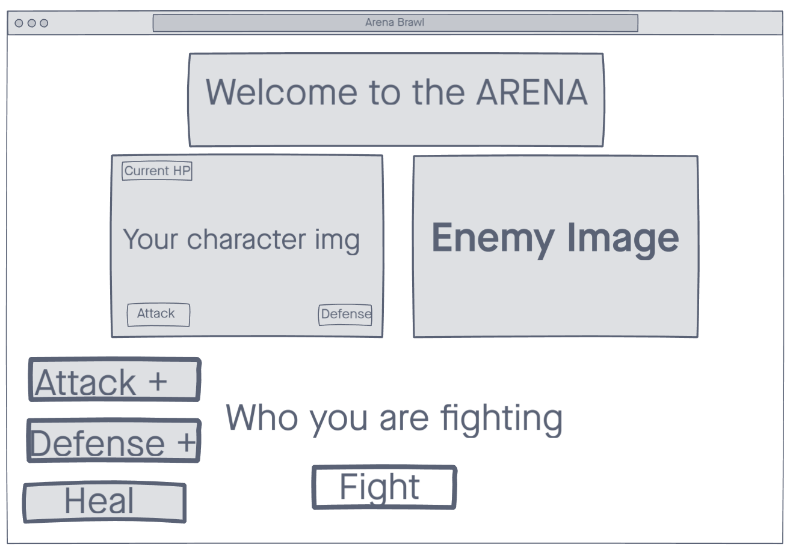

# GA.Project1 
by Alex Shaver
# Arena Brawl
https://dizzion.github.io/GA.Project1/
## Overview

 **Arena Brawl** is a battle based game that takes place between you, the Gladiator, and the other combatants. I wanted to make a fun combat based game with different possibilities and outcomes based on how you play. Last one standing is the **WINNER**. Help Bob, the Conqueror, defeat his enemies and rise to the top to become the **ULTIMATE WARRIOR**. But if Bob, the Conqueror, dies you lose and must restart the game.




## Explanation of Arena Systems

### User Interaction
There are 4 buttons that the user will interact with while playing Arena Brawl in the browser.
* Fight!
    * This button will cause the game to call the opponent for you to fight calculating damage dodge chances and displaying victory or defeat in an alert to the user. If you are defeated the game will reset and you will have to start over
* Victory buttons (these buttons only do anything when the user has won their match and only one can be choosen each win)
    * Attack +
        * This button increases the Attack Points of the player by 1
    * Defense +
        * This button increases the damage resistance (defense) of the player by 1
    * Heal
        * This button can only be activated on press **TWICE** per **FULL GAME**. This button heals the user to full HP.

Below the img of the players character the page will show what or who they are going up against that round
There will be 9 opponents that the player could face but there will only be 4 matches played
* Difficulties selected on page open through opening modal
    * Easy - 3 Opponents
    * Medium - 6 Opponents
    * Hard - All(9) Opponents

Inside the 8-bit Character img in the upperleft will display your Health in the lower left will display attack and lower right will display defense.

The entire page has a background img of the Colosseum.

There will be a base class that creates objects for the 9 opponents and player. These classes will inherit some functions and values that will need to be in the object for fight to read. Opponents and the player will deal random base damage before the attack value gets added between 1 and 3. Certain enemies will dodge more or less based on their race.

**Challenge to myself** make the fight function **Pause during each damage iteration and update the HP of the player** after each hit so that the user can visually see each time they are hit in a fight.

## Javascript Template

```js
// Base Class
class NPC {
    constructor(hp, atk, def, race)
    {
        this.health = hp;
        this.attack = atk;
        this.defense = def;
        this.race = race;
        this.name = race;
        this.life = true;
        this.speed = 0;
    }
    // dodge chance function
    dodgeChance()
    {
        // Elf and Dark Elf dodgeChance()
        if(this.race == "Elf" || this.race == "Dark Elf")
        {
            //  60% chance to dodge
            if(Math.ceil(Math.random() * 100) > 40)
            {
                return true;
            }
            else
            {
                return false;
            }
        }
        // Orc, Ogre and Undead dodgeChance()
        else if(this.race == "Orc" || this.race == "Ogre" || this.race == "Undead")
        {
            //  15% chance to dodge
            if(Math.floor(Math.random() * 100) > 85)
            {
                return true;
            }
            else
            {
                return false;
            }
        }
        // Halfling and Goblin dodgeChance()
        else if(this.race == "Halfling" || this.race == "Goblin")
        {
            //  65% Chance to dodge
            if(Math.ceil(Math.random() * 100) > 35)
            {
                return true;
            }
            else
            {
                return false;
            }
        }
        // Any other Race dodgeChance()
        else
        {
            //  35% Chance to dodge
            if(Math.ceil(Math.random() * 100) > 65)
            {
                return true;
            }
            else
            {
                return false;
            }
        }
    },
    deathCheck()
    {
        // check if this.life == true or false at the end of the fight function
        // if dead shift this combatant out of the enemy array
    },
    dmgTaken(num)
    {
        // minus the damage taken from the objects HP
    }
    dealDMG()
    {
        // calculate the damage this combatant will do
    }
};
```

Withing the fight function there will be checking the amount of dmg that each combatant will be doing and putting that number into the dmgTaken(npc1.dealDMG()) freeing up the extra space by moving the damage taken and damage dealt to the base class I can change who goes first based on the speed of that race.

### Example
```js
if ((npc1.speed === true) && (npc2.speed === true))
{
    // attack at the same time
}
else if (npc1.speed === true)
{
    // npc1 attacks first
}
else if (npc2.speed === true)
{
    // npc2 attacks first
}
else
{
    // attack at the same time
}
```
